# Ruby is ⌚️ing

## #inspect 2015 🇫🇷

### Boris Bügling - @NeoNacho


<!--- use Poster theme, black -->

---

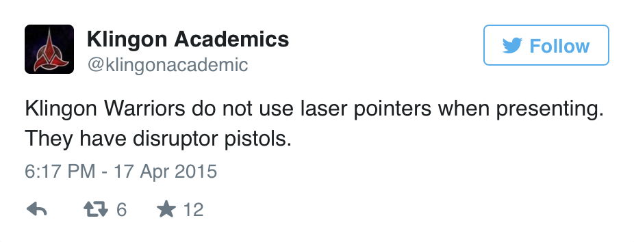

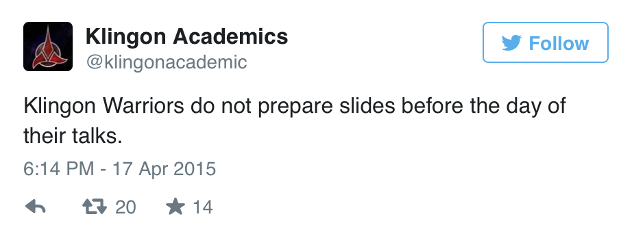

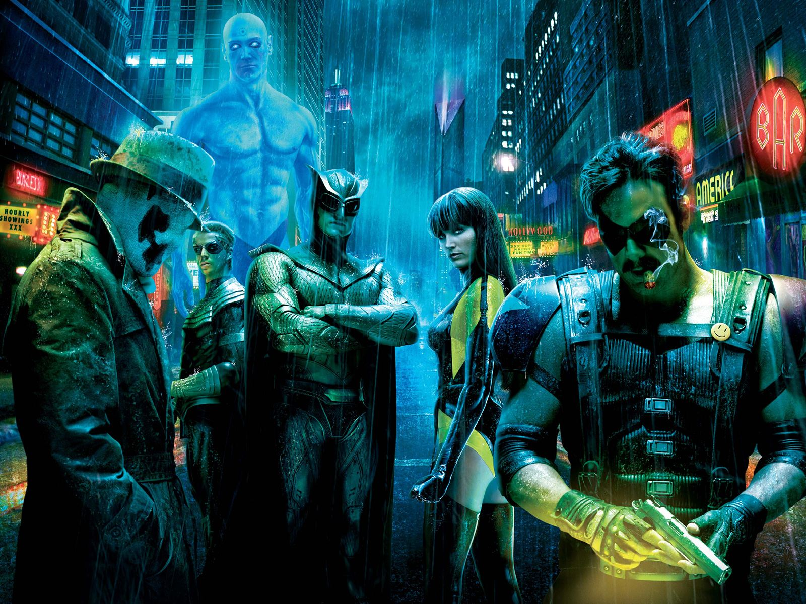

---

## CocoaPods


---

## Contentful

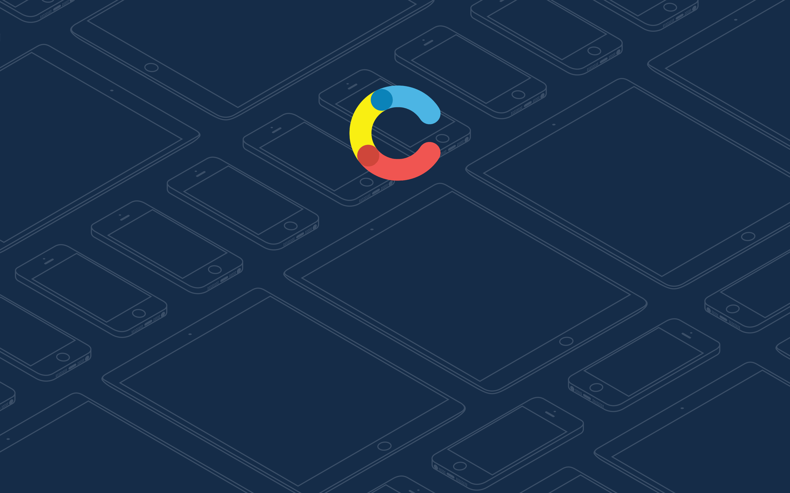

---

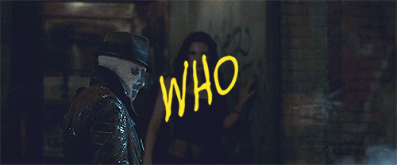

---

# 💰💰💰💰


---

# Agenda

- ᴡᴀᴛᴄʜ
- Android Wear
- Developing for both with RubyMotion
- Building a simple app


---

# ᴡᴀᴛᴄʜ


---

# watchOS 1.x

- Notifications
- Glances
- WatchKit apps


---

# Notifications

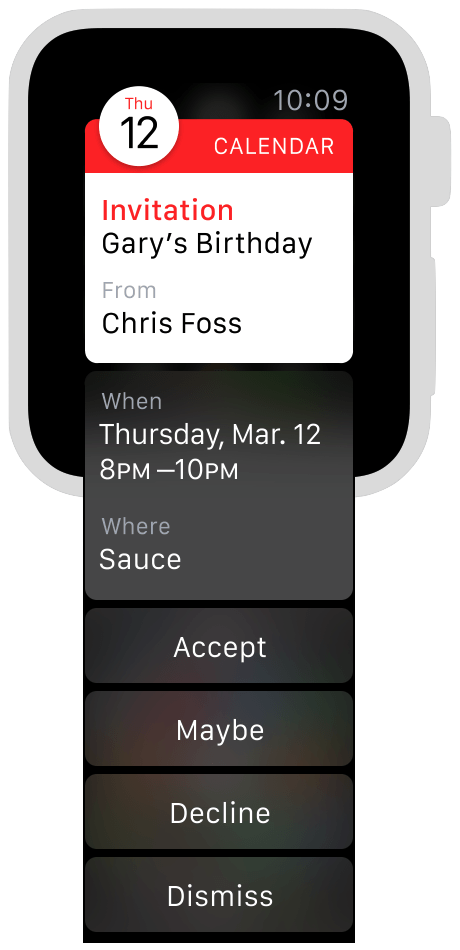


---

# Glances

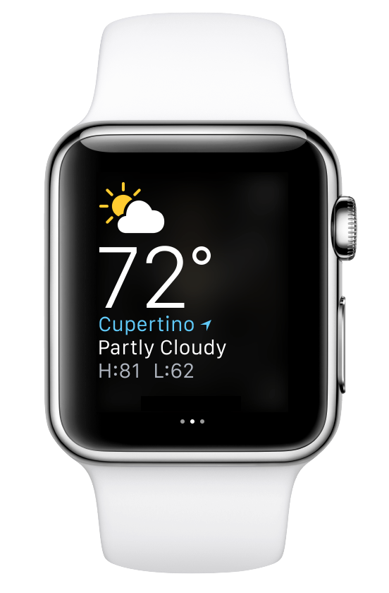


---

# WatchKit

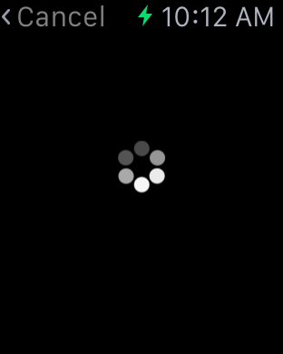


---

# watchOS 2.x

- Apps run natively on the watch
- Custom complications


---

# !!!


---

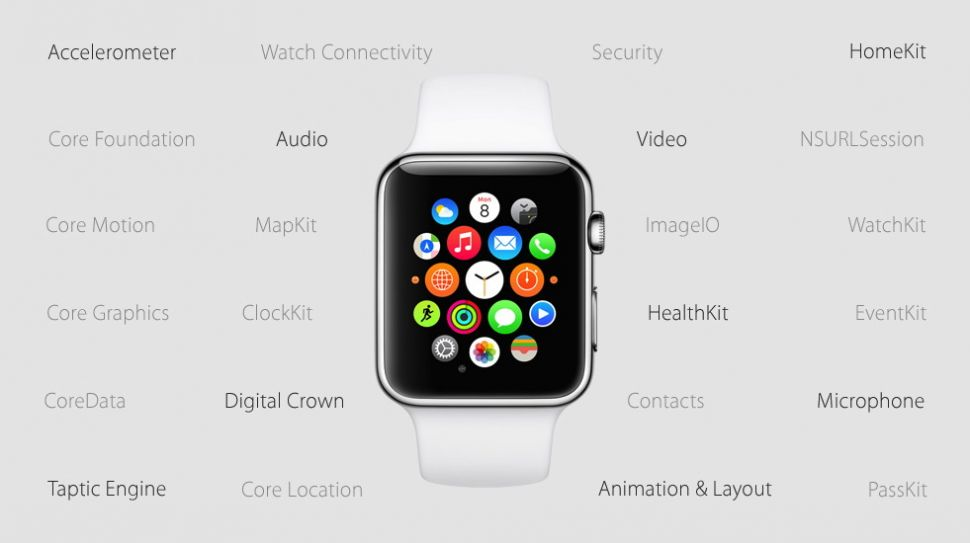

---

# Complications

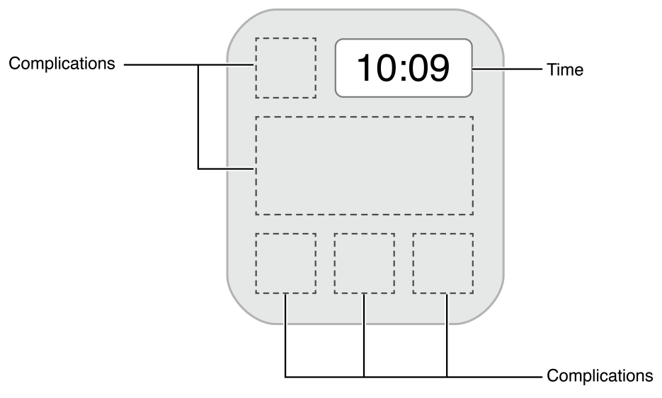


---

# Android Wear

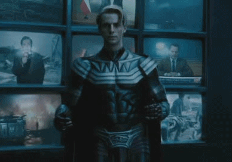

---

# Android Wear

- Enhanced Notifications
- Wearable Apps


---

# Enhanced Notifications

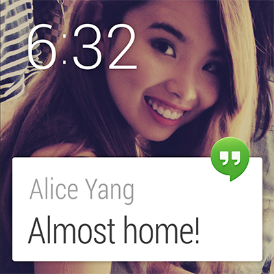


---

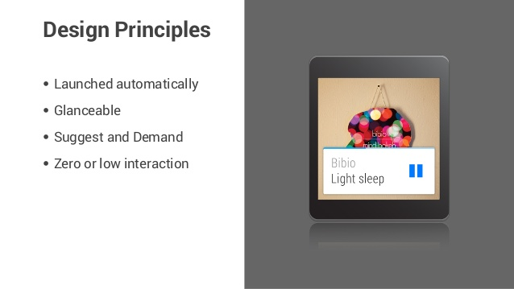

---

# Wearable Apps

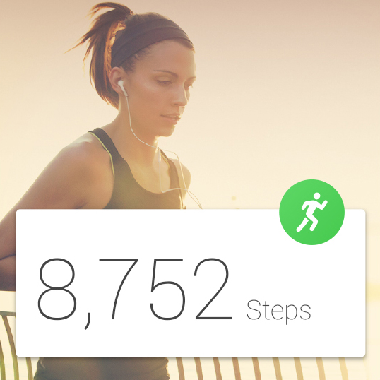


---

## => pretty much the same

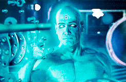

---

# => RubyMotion


---


---

# Rakefile

```ruby
Motion::Project::App.setup do |app|
  [...]
  app.target 'WatchApp', :watchapp
end
```

---

# Resources

- Interface.storyboard
- Asset catalogs


---

# WatchApp/Rakefile

```ruby
[...]

require 'ib/tasks'

IB::RakeTask.new do |project|
  project.resource_directories = ['watch_app']
end
```

---

# Extension Delegate

```ruby
class ExtensionDelegate
  def applicationDidFinishLaunching
  [...]
  end

  def applicationDidBecomeActive
  [...]
  end

  def applicationWillResignActive
  [...]
  end
end
```

---

# Interface Controller

```ruby
class InterfaceController < WKInterfaceController
  extend IB

  def initWithContext(context)
    if super
      [...]
      self
    end
  end

  def willActivate
  [...]
  end

  def didDeactivate
  [...]
  end
end
```

---

# WKInterfaceController

- Navigation
- Presentation
- Handoff
- Handle notification actions
- Communicate with parent app


---

# Running the app in the sim

```bash
rake watch
```


---

## Android Wear isn't really supported, yet

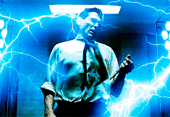

---

# Building a simple app


---

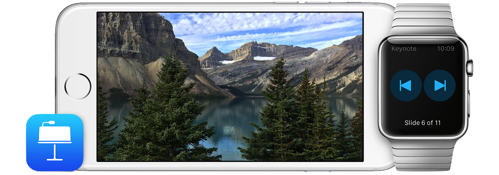


---

# WatchPresenter

- Remote controls Deckset instead
- Direct connection to the Mac
- Shows a preview of the slides
- Measures heartrate to display the "most exciting" slide
- Taps you if you're running out of time


---

## Multipeer Connectivity!

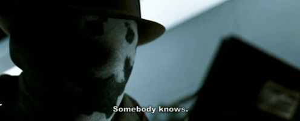

---

# Available Frameworks

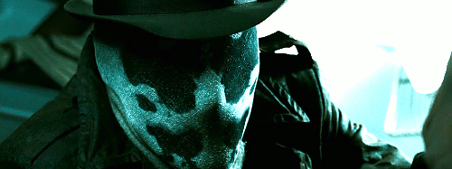

---

CFNetwork.framework
ClockKit.framework
Contacts.framework
CoreData.framework
CoreFoundation.framework
CoreGraphics.framework
CoreLocation.framework
CoreMotion.framework
EventKit.framework
Foundation.framework

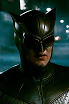

---

HealthKit.framework
HomeKit.framework
ImageIO.framework
MapKit.framework
MobileCoreServices.framework
PassKit.framework
Security.framework
UIKit.framework
WatchConnectivity.framework
WatchKit.framework

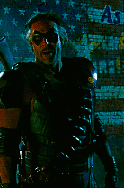

---

# BT APIs are private :(


---

# Other options

- `NSURLSession` via Wi-Fi
- WatchConnectivity.framework to talk via the phone


---

# HealthKit.framework

- not usable in the Watch simulator

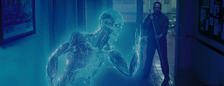

---

# Taptic Engine

```objectivec
typedef NS_ENUM(NSInteger, WKHapticType) {
    WKHapticTypeNotification,
    WKHapticTypeDirectionUp,
    WKHapticTypeDirectionDown,
    WKHapticTypeSuccess,
    WKHapticTypeFailure,
    WKHapticTypeRetry,
    WKHapticTypeStart,
    WKHapticTypeStop,
    WKHapticTypeClick
} WK_AVAILABLE_WATCHOS_ONLY(2.0);
```

```ruby
WKInterfaceDevice.currentDevice.playHaptic(WKHapticTypeStart)
```

---

### but also not usable in the sim


---

# Demo

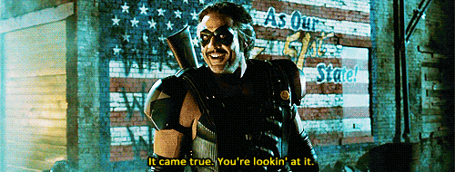

---

# Tips


---

# `printf` debugging is great!


---

# MMWormhole

- watchOS 1.0: `CFNotificationCenter`
- watchOS 2.0: WatchConnectivity.framework

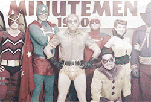

---

# Force quit apps

- Long press until "reboot" menu
- Long press again


---

## If in doubt, reboot the watch :)


---

# What have we learned?

- 


---

# Thank you!


---

- https://developer.apple.com/watch/human-interface-guidelines/
- https://developer.apple.com/library/prerelease/watchos/documentation/General/Conceptual/AppleWatch2TransitionGuide/
- https://developer.android.com/wear/index.html
- https://github.com/shu223/watchOS-2-Sampler
- http://www.kristinathai.com/category/watchkit/
- http://www.slideshare.net/peterfriese/introduction-to-android-wear


---

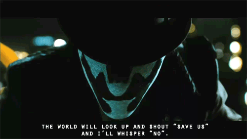

---

@NeoNacho

boris@contentful.com

http://buegling.com/talks


